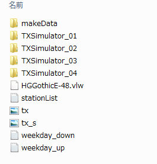
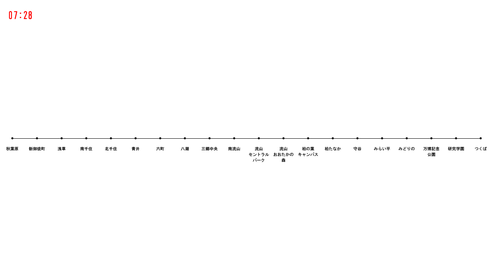

# つくばエクスプレスの運行状況視覚化に挑戦 (1)

## つくばエクスプレスの運行状況視覚化について

ここからは，つくばエクスプレスの運行状況の視覚化に挑戦してもらいます．このミッションの趣旨は， つくばエクスプレスという我々とって身近な対象を取り扱うことで，その視覚化の様子による恩恵を大きく感じてもらうことです．

まずは，以下のプログラムをダウンロードし，実行させてみてください．

<a href="TXSimulator.zip">つくばエクスプレスシミュレータ一式</a>

このフォルダの中には，フォントや画像ファイル等が入っております．展開すると以下のような画面になると思います．

※まずは，TXSimulater_01を実行してみましょう．

プログラムの実行がうまくゆけば，以下のような実行画面が出てきます．

## プログラムの解説

このプログラムでは，大きく2つの機能を実現しています．まず1つめは，どの時点の運行状況なのかをあらわす時刻の表示．そして2つめは，各駅の配置です．これらの土台があって，つくばエクスプレスの視覚化が実現できるようになります．

<a href="../TX_visualization_2/Tx_visualization_2.html">次へすすむ→</a>

<a href="../link_1/link_1.html">←前にもどる</a>

<a href="../index.html">トップにもどる↑</a>

