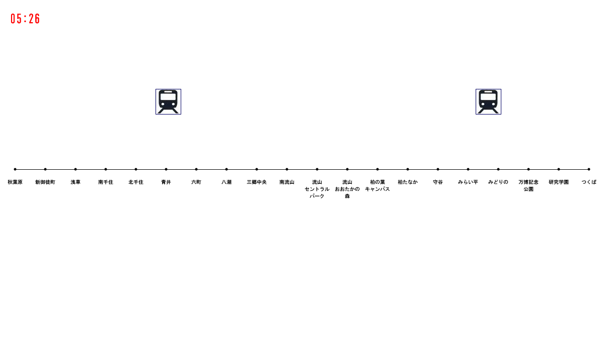

# つくばエクスプレスの運行状況視覚化に挑戦 (2)

## エクスプレスを走らせて見よう

ではつぎに，TXSimulater_02を実行してみましょう．すると次のような画面が出てくると思います．

## プログラムの解説

このプログラムでは，TXsimulator_01に加えて，TX_DATAの配列に基づき列車を運行しています．

<a href="../TX_visualization_3/Tx_visualization_3.html">次へすすむ→</a>

<a href="../TX_visualization_1/Tx_visualization_1.html">←前にもどる</a>

<a href="../index.html">トップにもどる↑</a>

