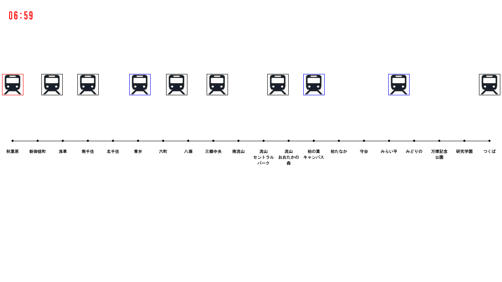

# つくばエクスプレスの運行状況視覚化に挑戦 (3)

## 下りのすべての運行状況の視覚化

ではつぎに，TXSimulater_03を実行してみましょう．すると次のような画面が出てくると思います．

## プログラムの解説

このプログラムでは，TXsimulator_02に加えて，外部ファイルからTX_DATAの配列に読み込みを行い，下りのすべての運行状況を視覚化しています．

<a href="../TX_visualization_4/Tx_visualization_4.html">次へすすむ→</a>

<a href="../TX_visualization_2/Tx_visualization_2.html">←前にもどる</a>

<a href="../index.html">トップにもどる↑</a>

