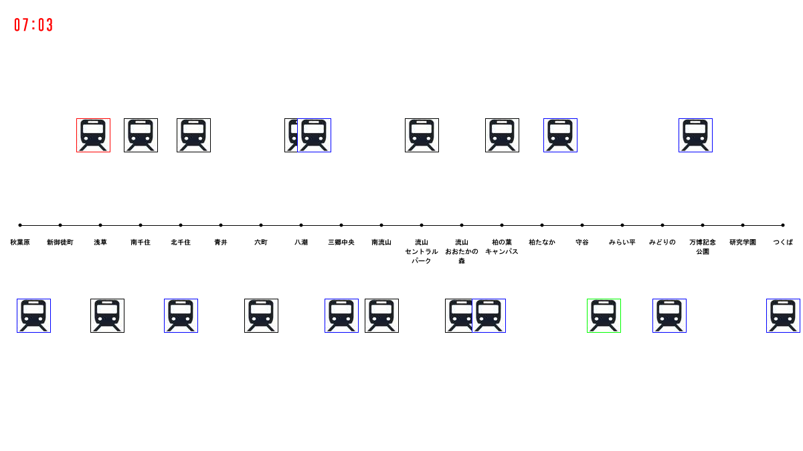

# つくばエクスプレスの運行状況視覚化に挑戦 (4)

## 上り下りのすべての運行状況の視覚化

ではつぎに，TXSimulater_04を実行してみましょう．すると次のような画面が出てくると思います．

## プログラムの解説
このプログラムでは，TXsimulator_03に加えて，外部ファイルからTX_DATAの配列に読み込みを行い，上りと下りのすべての運行状況を視覚化しています．

<a href="../TX_visualization_5/Tx_visualization_5.html">次へすすむ→</a>

<a href="../TX_visualization_3/Tx_visualization_3.html">←前にもどる</a>

<a href="../index.html">トップにもどる↑</a>

