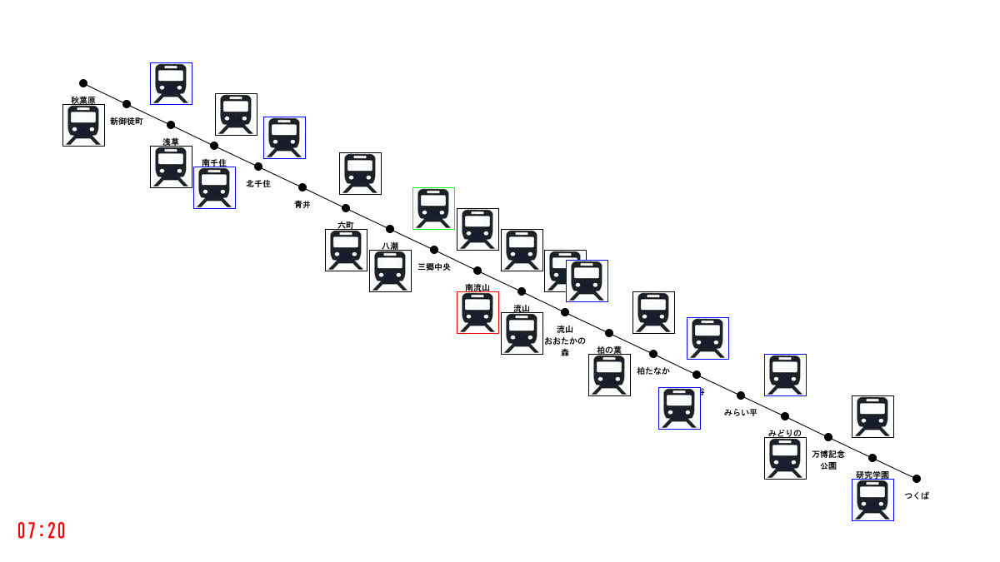

# つくばエクスプレスの運行状況視覚化に挑戦 (5)

## 1次元から2次元へ拡張

ではつぎに，以下のTX_smiulator_05をダウンロード,展開し，実行してみましょう．すると次のような画面が出てくると思います．

<a href="TXSimulator_05.zip">Tx_Simulator_05</a>

## プログラムの解説

このプログラムでは，TXsimulator_04に対して，2次元に配置して，地図の上を走っているようなイメージを創出しています．

<a href="../TX_visualization_7/Tx_visualization_7.html">次へすすむ→</a>

<a href="../TX_visualization_4/Tx_visualization_4.html">←前にもどる</a>

