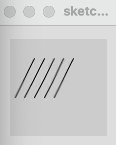

# エディタの使い方、描画窓、点や線の書き方

### エディタの使い方
「Processing」を実行すれば、以下のようなエディタが起動し準備完了です。

  

ここで、エディタ上部のボタンについて説明します。
これらのボタン群、左から

- 「Run」 プログラムのコンパイル、実行
- 「Stop」実行中のプログラムの中止
- 「Debug」デバッグモードの切り替え
- 「Java」プログラミング言語 本資料ではJavaを使用します

にそれぞれ対応しています。

ファイルの保存や新規作成は、メニューの「File」から行うこともできます。
保存のショートカットは、Windowsなら「Ctrl+s」、Macなら「Command+s」です。
新規作成のショートカットは、Windowsなら「Ctrl+n」、Macなら「Command+n」です。

## 描画窓と線の書き方

では、さっそく以下のように打ち込んで、実行(Run)させてみましょう。ここで、「//」の後ろは、すべてコマンドの機能を説明するためのコメントなので打ち込まなくてもよいです。

  

このプログラムを実行すると、以下のような窓が現れて、点と線が描画されるはずです。うまくいったでしょうか？

  

プログラム中の各コマンドの働きを、コメント文を参考に理解しましょう。

また各コマンドの機能の詳細は以下のリンクでも学んでください。

1. <a href="https://processing.org/reference/size_.html" target="_blank">size</a>
2. <a href="https://processing.org/reference/point_.html" target="_blank">point</a>
3. <a href="https://processing.org/reference/line_.html" target="_blank">line</a>

## Processing の描画機能に慣れるための練習

*<練習プログラム1>*

  

*<練習プログラム1の実行結果>*

  

*<練習プログラム2>*

  

*<練習プログラム2の実行結果>*

  

