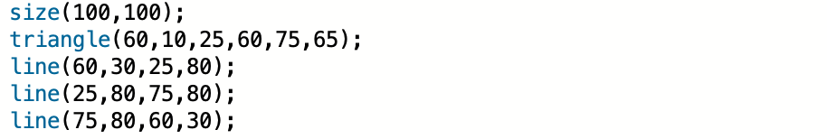
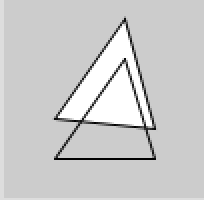
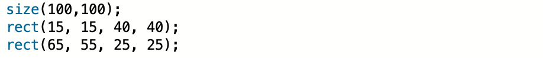
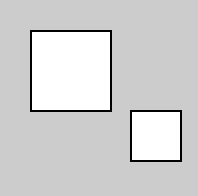
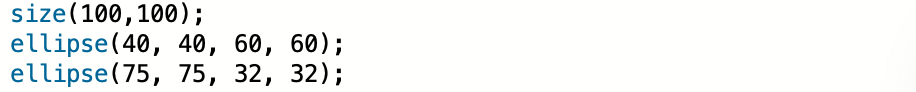
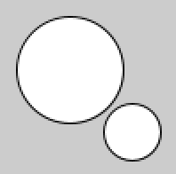

# 色々な図形の描画および色指定の方法

### 三角形の描画

三角形の描画には、triangleコマンドを使います。以下のサンプルプログラムは、lineによる三角形の描画と、triangleコマンドによる描画の様子を示すものです。

＜サンプルプログラム2A＞

  

＜サンプルプログラム2Aの実行結果＞

  

triangleコマンドの場合、特に指定をしなければ内部が塗りつぶされるようになっています。

 

 

 

### 四角形の描画

四角形の描画には rect コマンドを使う。以下のプログラムを打ち込んでみよう。

＜サンプルプログラム2B＞

  

＜サンプルプログラム2Bの実行結果＞

  

### 円の描画

円の描画には ellipse コマンドを使う。以下のプログラムを打ち込んでみよう。

＜サンプルプログラム2C＞

  

＜サンプルプログラム2Cの実行結果＞

  

 
 

 

 

 

以上、三角形、四角形、円といった基本的な図形描画のコマンドは理解できたでしょうか？サンプルプログラムをいろいろ変更し、しっかり理解しましょう。