# 変数の取り扱い、ループ制御

### 変数の取り扱い

変数の種類ついては、我々がよく利用しているC言語あるいはMatlabと類似しています。以下のように、int型、float型、そして boolean型があります。

＜サンプルプログラム＞

  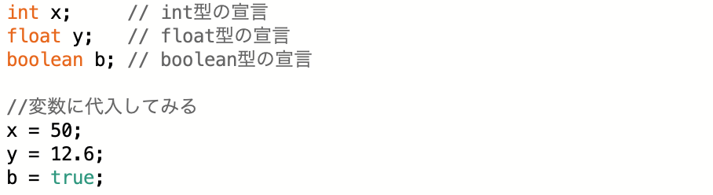

各変数の取り扱いに慣れるため、以下のサンプルプログラムを動かしてみよう。

---

＜サンプルプログラム3A＞

  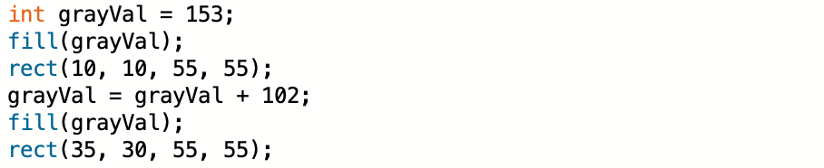

＜サンプルプログラム3Aの実行結果＞

  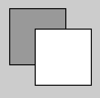

---

＜サンプルプログラム3B＞

  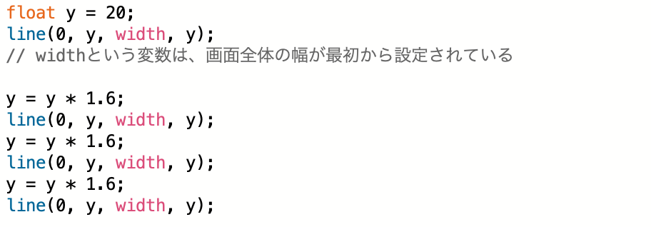

＜サンプルプログラム3Bの実行結果＞

  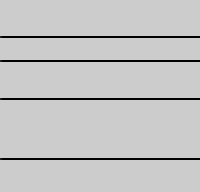

---

＜サンプルプログラム3C＞

  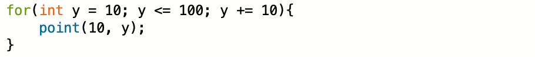

＜サンプルプログラム3Cの実行結果＞

  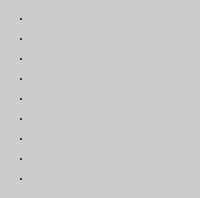

---

＜サンプルプログラム3D＞

  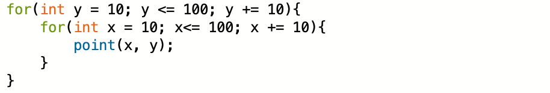

＜サンプルプログラム3Dの実行結果＞

  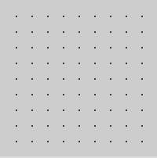

---

＜サンプルプログラム3E＞

  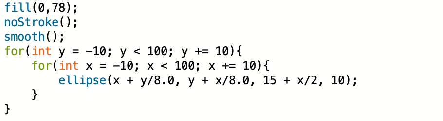

＜サンプルプログラム3Eの実行結果＞

  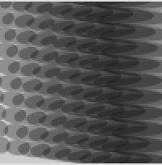

---

＜サンプルプログラム3F＞

  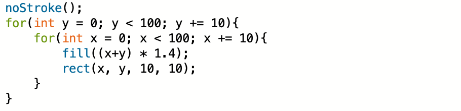

＜サンプルプログラム3Fの実行結果＞

  

---

＜サンプルプログラム3G＞

  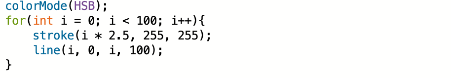

＜サンプルプログラム3Gの実行結果＞

  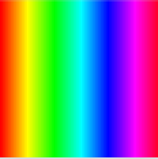

---

＜サンプルプログラム3H＞

  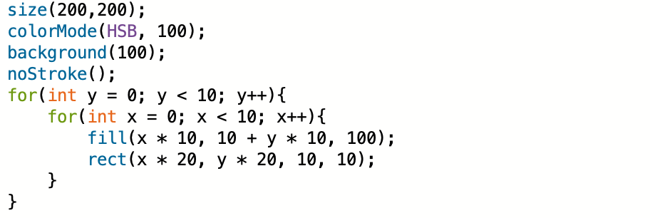

＜サンプルプログラム3Hの実行結果＞

  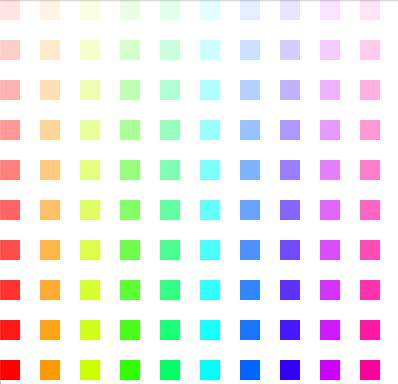

