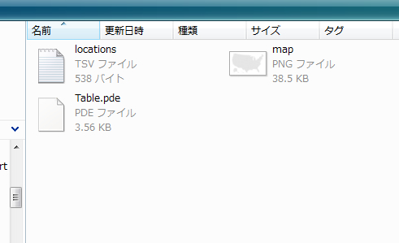
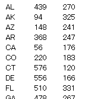
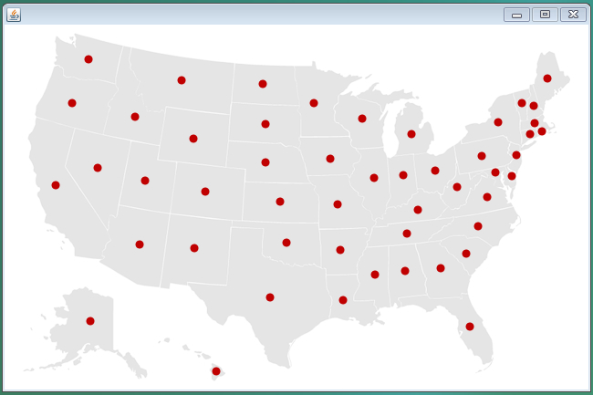

# Processingによる情報可視化 ステップ1

## データファイルを取り込んでマップ上に描画

下準備の段階で、画像map.pngを読み込んで描画できるようになっているはずです。今度は、「locations.tsv」というTSV形式（タブで区切ってあるデータ形式のこと）を読み込んで、それを画像上に描画します。

ここから、一気にプログラムが長くなるので十分注意してください！

1. まず、Table1.pde というプログラムを以下のリンクからダウンロードし、これをProcessing_dataのフォルダの下に保存してください。これを、Processing のエディタで開くと、Table1フォルダが作られるはずです。 作られない場合は、mappingのプログラム同様、Processingフォルダの下に保存してください。そうすると自動的にTable1フォルダが作られます。

[注意]計算機の環境によっては、ダウンロードしたプログラムがうまく動かない場合もあります。この場合はプログラムをコピー、そしてProcessingのエディタにペーストするとうまくゆくとおもいます。

<a target="_blank" href="./Table1.pde" download="./Table1.pde">Table1.pdeのプログラム</a>

Table1.pdeは、かなり長いプログラムなので、びっくりする人もいるかもしれませんが、後ほど、じっくりその構造について解説しますので、現段階では、こんなもんなんだ、と思って、以下の作業を進めてください。

2. 次に、mappingフォルダにある「map.png」も、Tableフォルダにコピーしましょう。また、以下の「location.tsv」というTSV形式のデータもダウンロードし、Tableフォルダにコピーしましょう。以上の操作から、フォルダの中身は以下のようになっているはずです。

<a target="_blank" href="./Table/locations.tsv">locations.tsv をダウンロード</a>

  

ちなみに、「locations.tsv」の中身は、以下のようなデータが格納されております。
1列目は米国の各州の略称、2列目はX座標、3列目はY座標を示しています。

  

この状態で、Table1.pdeを実行してみましょう。以下のような画面が出れば成功です。

  

## Table.pdeプログラムの解説

さて、ここから「Table.pde」プログラムの解説を行います。

Table.pdeプログラムでは、これまでのプログラムとは異なり、構造化プログラミングという技法が導入されています。これはプログラムに

- 初期化部　setup()
- メインループ draw()
- その他の関数・・・

という構造を持たせ、より高度な機能を実現させるためのものです。Table1.pdeを注意深く見てください。上記の構造のように

- 初期化部　setup()
- メインループ draw()
- Tableクラスの定義

といった構造を持っていることがわかると思います。

初期化部では、ウィンドウサイズの設定や、読みこむ画像、TSVファイルの宣言などを行います。

メインループdraw()では、文字通り、ここのループがメインになりプログラムを動かしてゆくことになります。最初のうちは、あまり意識しませんが、このメインループは、1秒間に何十回という速さで、ループ処理を繰り返しています。マウスによるインタラクションの際、このループ処理の意味が理解できるようになると思います。現時点では、「ふーん、そうなの」という具合で、流してもらって結構です。

このdraw()では、その下で定義されているTableクラスの各種関数を呼び出すことで、高度な機能を実現させることができます。このTable1.pdeプログラムでは、下のTableクラスのごく一部の関数しか使っていないので、プログラムの構造を理解するには、初期化部とメインループだけ重点的に注意すれば十分です。

#### 初期化部の解説

さて、Table1.pde プログラムでは、初期化部で、画像ファイル「map.png」、TSV形式のファイル「locations.tsv」 、そしてlocationTable.getRowCount()というコマンドで、locations.tsvファイルの行数をカウントし、その結果をrowCountに格納しています。locationTable.getRowCount()は、メインループの下のTableのクラスで定義されており、詳細は、そちらを参照してもらうとよいと思います。もし、詳細が理解できなければ、「まあ、こんなもんだろう」、という感じで流していただいて結構です。

#### メインループの解説

Table1.pdeのメインループ、すなわちdraw()の部分についてですが、まず、背景を255にセット、「map.png」ファイルを、座標(0,0)の位置を始点として貼り付けています。この画像の上に、location.tsvから読み込んだ座標に基づき、マルを描いてゆくのが、メインループの主なお仕事です。

for文では、初期化部において取得したtsvファイルの行数rowCountが使われており、0行目からrowCount目まで、順次、数値を読みだし、それらをx,y座標としてellipseコマンドでマルを描く、という流れになっております。簡単でしょう？

また、目で確認するのが難しいですが、このdraw()のメインループは、1秒間に何十回という速さでループし、描画を繰り返しています。これを実感するために、ちょっと横道にそれますが、以下のプログラムを実行してみてください。

## メインループの繰り返し処理を実感しよう

以下のプログラムを、コピー、ペーストし、ちょっと動かしてみてください。

<a target="_blank" href="./sample.pde">サンプルプログラム</a>

どうですか？メインループの中が、ものすごい速さで繰り返し処理され、カラフルな四角形がどんどん描画されているのがわかりましたか？米国の地図を描画するプログラムでは、毎回、同じ処理が行われるため、メインループが繰り返し処理されているのがわかりにくいのですが、実際は、1秒間に何十回という速さで、画像を上書きをしています。

さて、これまでの流れを理解したら、次に進みましょう。

<a href="../mapping_2/mapping_2.html" >次にすすむ→</a>

