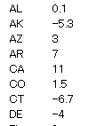
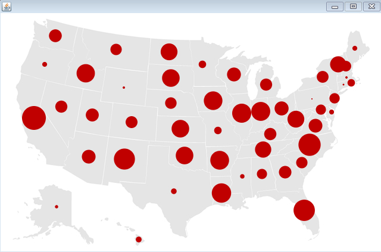
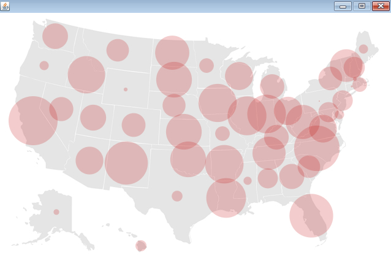

# Processingによる情報可視化　ステップ2
## 描画方法の工夫　その１

前のプログラムでは、米国の各州ごとに、マルを同じ大きさで描画してゆきましたが、もう少し工夫してみましょう。具体的には、「random.tsv」というファイルに各州のマルの大きさを、ランダムに書き込んだものを準備し、それに従い描画します。これを実行するために、初期化部、メインループを修正し、さらに、drawData()という関数を新たに追加します。 詳細な変更については、プログラム内にコメントとして書き込んでありますので、 そちらを参考にしてください。

それでは、まず、以下のリンクを開き、プログラム「Table2.pde」をコピーアンドペーストして保存してください。※ダウンロードして、エディタで開くと文字化けしてしまう可能性があります。 これ以降は、コピーアンドペーストでゆきましょう！

<a target="_blank" href="Table2.pde">Table2.pdeのプログラム</a>

これをProcessingで開き保存すると、Table2 というフォルダができることを確認しましょう。

次に、「random.tsv」というファイルを、以下のリンクからダウンロードして、Table2 のフォルダに入れましょう。また、「map.png」と「location.tsv」のファイルも、それぞれ一緒のフォルダに入れましょう。 これらのファイルがないと、プログラムは動きませんので、十分に注意してください。

<a href="random.tsv" target="_blank">random.tsvのダウンロード</a>

random.tsv ファイルの中身は、以下のようになっております。

以上で、準備は完了です。Table2.pde を実行させてみましょう。以下のような画面が出てくれば、成功です。

Table2.pde 内に書かれているコメント、そして、新しく出てきたmap関数についてのリファレンスも参考にしてください。

<a href="http://processing.org/reference/map_.html" target="_blank">map関数の説明</a>

以上の手順、うまくこなせましたか？

#### 練習問題

- マルの大きさの最大値、最小値がそれぞれ 40　と 2 に設定されていましたが、これを変更してみましょう。どうなりますか？

- 赤いマルで塗りつぶすのは、あまりセンスがないので、すこし透明にするには、どうしたらよいでしょうか？

以下の図は、大きさを変更して、透明にしたところです。ちょっと印象が変わりましたね。

さて、Processing にも慣れて、どんどん色々なことができるようになってきましたね。

次は、色の取扱いに着目してプログラミングしてみましょう。<a href="../mapping_3/mapping_3.html">次にすすむ→</a>

<a href="../mapping/mapping_1.html">←前にもどる</a>

<a href="../index.html">トップにもどる↑</a>
