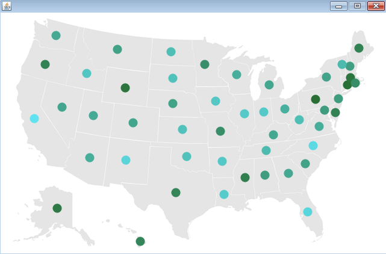

# Processingによる情報可視化　ステップ3

## 描画方法の工夫　その2

前のプログラムでは、マルの大きさを変更し描画しましたが、今度のプログラムでは、大きさは変更せずに、色遣いによって数値の大小を視覚化します。具体的には、赤から青までの範囲に数値を対応させることにします。前回同様、「map.png」、「locations.tsv」「random.tsv」というファイルを、以下のTable3.pdeというプログラムのあるフォルダにコピーし、実行準備を整えてください。

まずは、以下のリンクにあるTable3.pde をコピーアンドペーストし、それを保存しTable3というフォルダを作りましょう。

<a href="Table3.pde" target="_blank" download="Table3.pde">Table3.pdeのプログラム</a>

この Table3.pde を実行し、以下のような画面が出ると成功です。

今回の Table3.pde では、新しい関数 norm と lerpColor が登場してきます。これらについては、プログラム中のコメントおよびリファレンスでしっかり理解しておきましょう。

<a href="http://processing.org/reference/norm_.html" target="_blank">norm の説明  </a>

<a href="http://processing.org/reference/lerpColor_.html" target="_blank">lerpColor の説明</a>

## 練習問題

**色の範囲を、自分なりに調整してみてください。**

例： color between = lerpColor(#296F34, #61E2F0, percent);

この例に基づくと、以下のような感じの描画になります。シックな感じになったと思いませんか？

どんどん高度な機能を追加してゆきましょう。　<a href="../mapping_4/mapping_4.html">次へすすむ→</a>

<a href="../mapping_2/mapping_2.html">←前にもどる</a>

<a href="../index.html">トップにもどる↑</a>
