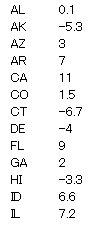
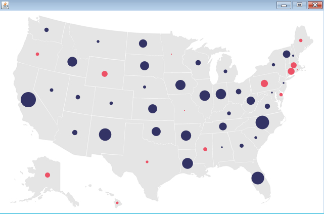

# Processingによる情報可視化　ステップ4

## 描画方法の工夫　その3

すでに、これまでのプログラムで取り扱っている「random.tsv」についてですが、よく見ると、正負の数が混在しているのに気がつくと思います。

この正負を区別して表示させたい、というのは自然な欲求かと思います。今回は、正負をそれぞれ色遣いを分けて描画してみましょう。前回同様、「map.png」、「locations.tsv」「random.tsv」というファイルを、以下のTable4.pdeというプログラムのあるフォルダにコピーし、実行準備を整えてください。

Table4.pde を以下のリンクからコピーアンドペーストし、Table4というフォルダを作りましょう。

<a href="Table4.pde" target="_blank">Table4.pdeのプログラム</a>

Table4.pde を実行し、以下のような画面が出れば成功です。

そろそろ、色を調整するのにも飽きてきましたね。次はマウスを使ったインタラクションを盛り込んでゆきましょう。

<a href="../mapping_5/mapping_5.html">次へすすむ→</a>

<a href="../mapping_3/mapping_3.html">←前にもどる</a>

<a href="../index.html">トップにもどる↑</a>

