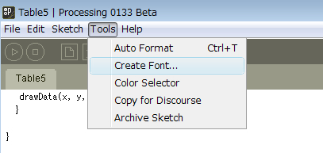
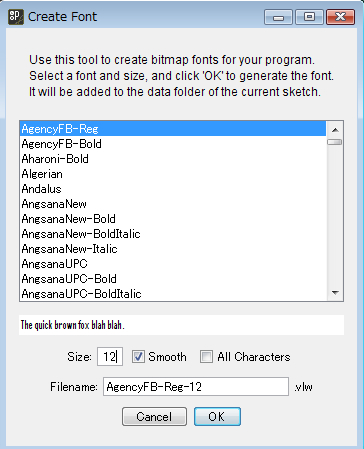
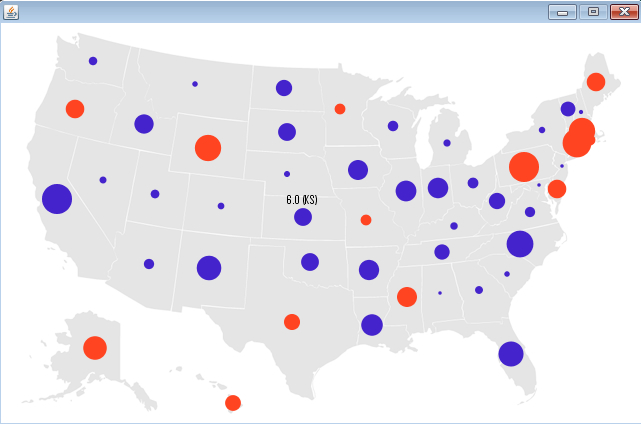

# Processingによる情報可視化　ステップ5

## マウスによるインタラクション機能の導入

これまでのプログラムでは、単にデータを表示させるだけでしたが、今回はマウスによるインタラクションの機能を導入します。

まず、以下の Table5.pde プログラムをこれまで同様、コピーアンドペーストし、Table5 というフォルダを作りましょう。 前回同様、「map.png」、「locations.tsv」「random.tsv」というファイルを、以下のTable5.pdeというプログラムのあるフォルダにコピーしてください。

<a href="Table5.pde" target="_blank">Table5.pdeのプログラム</a>

マウスのインタラクション機能を盛り込んだ Table5.pde というプログラムを実行する前に、下準備を行う必要があります。今回、マウスを使って、各州の情報を画面上に文字として表示させたいのですが、Processing では、文字を描画するために、フォントのファイルを一度準備しなければなりません。以下の手順で、フォントを準備しましょう。

上図のように、「Tools」の「Create Font」を選択してください。

基本的にどのフォントを選択してもよいのですが、今回は、 一番最初のフォントを選択しましょう。もし、違うフォントを選択したい場合は、プログラムを修正する必要があるので注意してください。

フォントサイズは「12」にセットしましょう。この状態で、「OK」を選択すると、Table5フォルダの下に、「data」というフォルダが新たに作られ、その中に選択したフォントが作成されているのが確認できると思います。

これで、準備完了です。Table5.pde を実行させてみましょう。以下の画面になり、マウスを動かして、各州の情報が出るようになれば成功です。

## プログラムの解説

プログラム Table5.pde では、マウスのポインタを各州にちかづけると、数値や州の略称が随時表示されるようになっておりました。この授業の前半において、メインループの繰り返し処理が、マウスのインタラクションで実感できると説明していたのは、実は、この部分だったのです。「マウスでポインタを近づけると、情報が表示され、ポインタを遠ざけると情報が消える」という処理、これは、メインループが1秒間に何十回というループ処理を行っており、そのループ処理内でマウスの位置と、各州のマルの距離を逐次判定していることで実現しています。

このメインループの繰り返し処理を使えば・・・何か、もっと面白いことができそうですね～。

それでは、もっと面白いことをしてみましょう。

<a href="../mapping_6/mapping_6.html">次へすすむ→</a>

<a href="../mapping_4/mapping_4.html">←前にもどる</a>

<a href="../index.html">トップにもどる↑</a>

