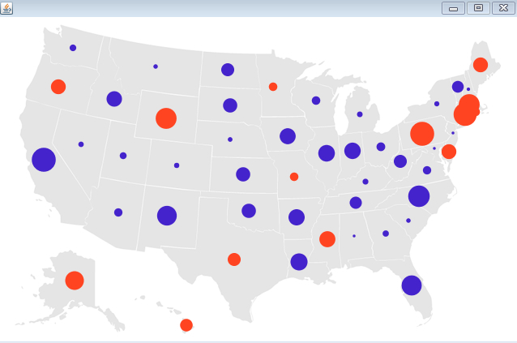
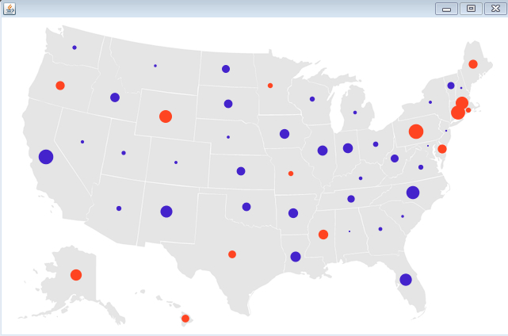

# Processingによる情報可視化　ステップ6

## メインループの繰り返し処理を利用した動的可視化

Table5.pde に対して、ちょっとした機能を付け加えた、Table6.pde を以下に準備しました。前回同様、「map.png」、「locations.tsv」「random.tsv」、そして「data」フォルダの下に、フォントを準備してください。

<a href="Table6.pde" target="_blank" download="Table6.pde">Table6.pdeのプログラム</a>

これを実行すると、どうなりましたか？

以下のように、円の大きさが動的に変化してゆくのが実感できるかと思います。

どのような仕組みで動いているのかといえば、プログラム内にカウンターを1つ準備し、これをsin関数の引数として使います。sin関数は、皆さんご存じのように、[-1,1]の間を振動する関数です。このカウンターをsin関数の引数として使い、この絶対値を、マルの描画の際の係数として重みづけします。そうすると、上のような動的に変化する可視化を実現することができます。

色を変化させたり、他にも、もっと面白いことができるかもしれません。自分なりに考えてみましょう。

<a href="../mapping_7/mapping_7.html">次のステップにすすむ　→</a>

<a href="../mapping_5/mapping_5.html">←前にもどる</a>

<a href="../index.html">トップにもどる↑</a> 
