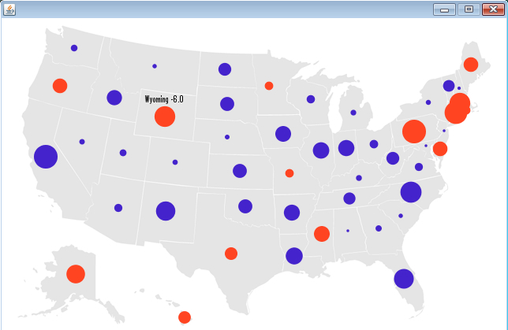

# Processingによる情報可視化　ステップ7

## テキスト情報の表示機能の拡充

Table6.pde では、ちょっと脱線してしまいましたので、ここで Table5.pde をベースにして、米国の各州の名前を略称ではなく、正式名称を表示するようにしてみましょう。米国以外に住んでいる皆さんにとっては、この可視化によって、米国に関する土地勘がかなり身につくのではないかと思います。

では、Table7.pde を以下のリンクからコピーアンドペーストしましょう。

<a href="Table7.pde" target="_blank" download="Table7.pde">Table7.pdeのプログラム</a>

前回同様、Table7フォルダの中に、「map.png」、「locations.tsv」「random.tsv」、そして「data」フォルダの下に、フォントを準備してください。

また、米国の各州の正式名称が格納された、「names.tsv」も準備しましょう。

<a href="names.tsv" target="_blank">names.tsv ファイルのダウンロード   </a>

Table7.pde を実行し、以下の画面が出てきたでしょうか？出てきたら成功です。

<a href="../link_1/link_1.html">次のページへすすむ→</a>

<a href="../mapping_6/mapping_6.html">←前にもどる</a>

<a href="../index.html">トップにもどる↑</a>

